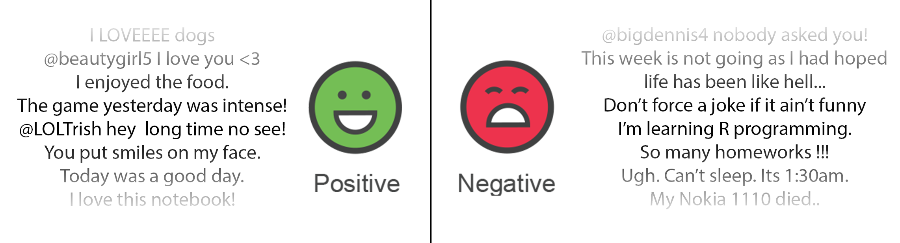

# Twitter Sentiment Analysis - Classical Approach VS Deep Learning

Photo by <a href="https://unsplash.com/@gaellemarcel?utm_source=unsplash&amp;utm_medium=referral&amp;utm_content=creditCopyText">Gaelle Marcel</a> on <a href="https://unsplash.com/s/photos/computer-text?utm_source=unsplash&amp;utm_medium=referral&amp;utm_content=creditCopyText">Unsplash</a>.

# Overview

This project's aim, is to explore the world of *Natural Language Processing* (NLP) by building what is known as a **Sentiment Analysis Model**. A sentiment analysis model is a model that analyses a given piece of text and predicts whether this piece of text expresses positive or negative sentiment.

To this end, we will be using the `sentiment140` dataset containing data collected from twitter. An impressive feature of this dataset is that it is *perfectly* balanced (i.e., the number of examples in each class is equal).

Citing the [creators](http://help.sentiment140.com/for-students/) of this dataset:

> *Our approach was unique because our training data was automatically created, as opposed to having humans manual annotate tweets. In our approach, we assume that any tweet with positive emoticons, like :), were positive, and tweets with negative emoticons, like :(, were negative. We used the Twitter Search API to collect these tweets by using keyword search*

After a series of **cleaning and data processing**, and after visualizing our data in a **word cloud**, we will be building a **Naive Bayezian** model. This model's goal would be to properly classify positive and negative tweets in terms of sentiment.
Next, we will propose a much more advanced solution using a **deep learning** model: **LSTM**. This process will require a different kind of data cleaning and processing. Also, we will discover **Word Embeddings**, **Dropout** and many other machine learning related concepts.

Throughout this notebook, we will take advantage of every result, visualization and failure in order to try and further understand the data, extract insights and information from it and learn how to improve our model. From the type of words used in positive/negative sentiment tweets, to the vocabulary diversity in each case and the day of the week in which these tweets occur, to the overfitting concept and grasping the huge importance of the data while building a given model, I really hope that you'll enjoy going through this notebook and gain not only technical skills but also analytical skills from it.

---

This notebook is written by **Joseph Assaker**. Feel free to reach out for any feedback on this notebook via [email](mailto:lb.josephassaker@gmail.com) or [LinkedIn](https://www.linkedin.com/in/joseph-assaker/).

---

Now, let's start with the fun 🎉

### **Table of Content:**

 1. Importing and Discovering the Dataset  
 2. Cleaning and Processing the Data  
  2.1. Tokenization  
  2.2. Lemmatization  
  2.3. Cleaning the Data  
 3. Visualizing the Data
 4. Naive Bayesian Model  
  4.1. Splitting the Data  
  4.2. Training the Model  
  4.3. Testing the Model  
  4.4. Asserting the Model    
 5. Deep Learning Model - LSTM  
  5.1. Data Pre-processing  
&nbsp;&nbsp;&nbsp;&nbsp;5.1.1. Word Embeddings  
&nbsp;&nbsp;&nbsp;&nbsp;5.1.2. Global Vectors for Word Representation (GloVe)  
&nbsp;&nbsp;&nbsp;&nbsp;5.1.3. Data Padding  
  5.2. Data Transformation  
  5.3. Building the Model  
  5.4. Training the Model  
  5.5. Investigating Possibilties to Improve the Model  
&nbsp;&nbsp;&nbsp;&nbsp;5.5.1. Regularization - Dropout  
&nbsp;&nbsp;&nbsp;&nbsp;5.5.2. Inspecting the Data - Unknown Words  
  5.6. Predicting on Custom Data  
  5.7. Inspecting Wrongly Predicted Data  
 6. Bonus Section
 7. Extra Tip: Pickling !
 8. Further Work
 
 
Continue reading the whole notebook [here](https://github.com/JosephAssaker/Twitter-Sentiment-Analysis-Classical-Approach-VS-Deep-Learning/blob/master/Twitter%20Sentiment%20Analysis%20-%20Classical%20Approach%20VS%20Deep%20Learning.ipynb).

You can also find this notebook, and give it an upvote 😊, on [Kaggle](https://www.kaggle.com/josephassaker/twitter-sentiment-analysis-classical-vs-lstm).
